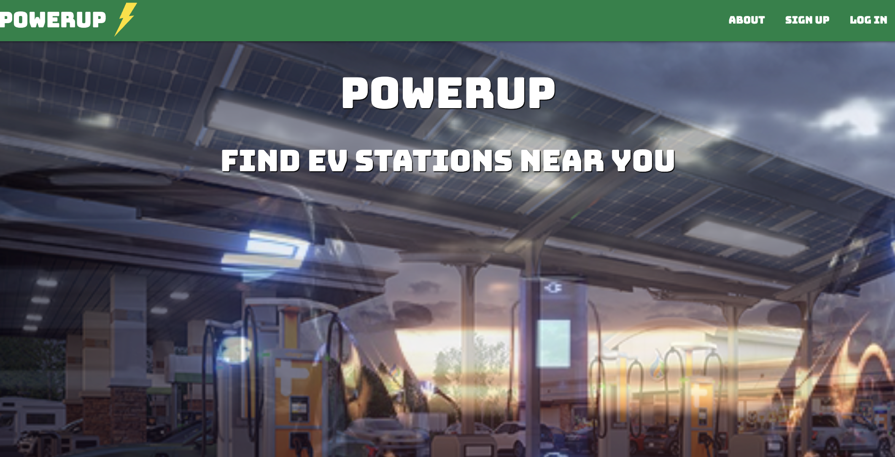

# Power Up: EV Charging
## The purpose of this app is to allow users to find the nearest EV charging stations, store vehicle information, and leave reviews. 

[Deployed App](https://powerup.herokuapp.com/) 

# Technologies Used: 

* HTML
* CSS
* JavaScript
* Python
* Django
* PostgreSQL
* Heroku Deployment
* Materialize Framework
* Trello
* ERD
* GitHub
* Docker
* Unit Testing

# Screenshots
### Home Page

### Station Results

# Future Enhancements
* Implements a station feed to view reviews from other users and live updates about local stations
* Include GPS/Mapping feature to give exact location of each station and directions
* Detailed tracking on each user vehicle to know how many miles are left in their charge
* Profile customization and personalization

